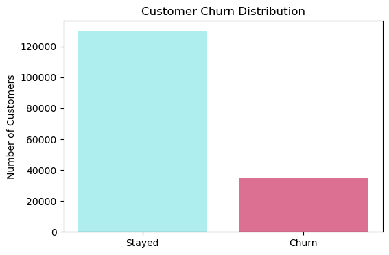
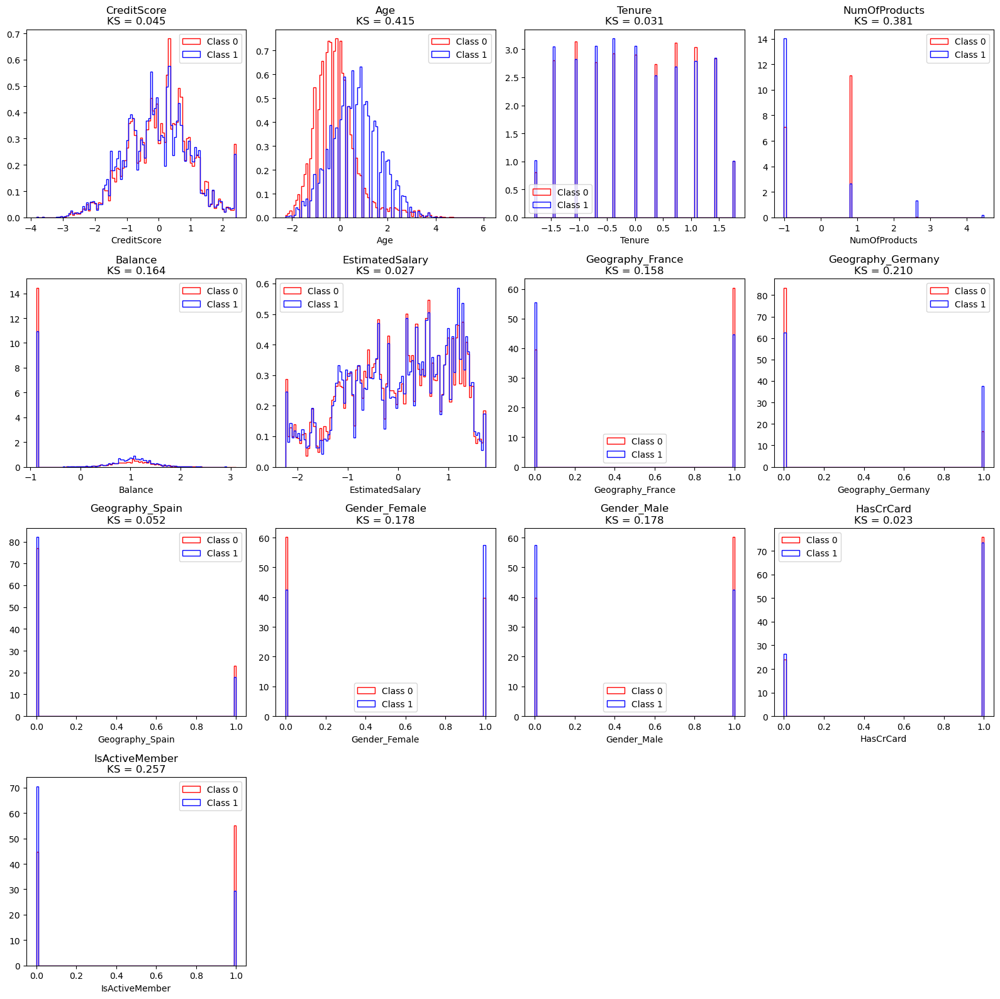
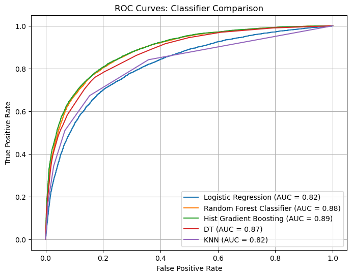
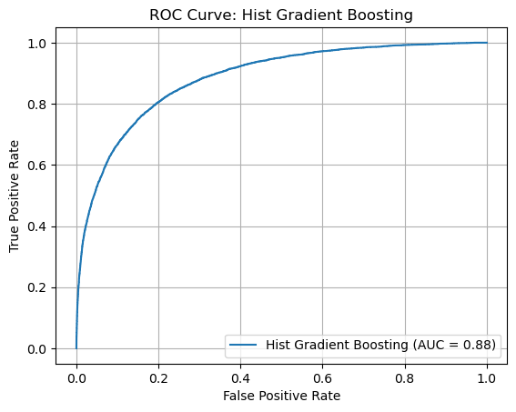

# Bank Churn Kaggle Challenge

This repository holds an attempt to apply Histogram-based Gradient Boosting to predict churn rates at a bank provided through the [Binary Classification with a Bank Churn Dataset](https://www.kaggle.com/competitions/playground-series-s4e1/overview) Kaggle challenge. 

## Overview

The goal of the Kaggle challenge was to use a tabular dataset containing various banking information to predict whether a customer keeps their account or churn it. This repository considers the task at hand a binary classification problem and uses different machine learning models to sample their performances. Then, the model with the best performance will undergo some model tuning before proceeding to apply it to the final dataset. In this case, Histogram-based Gradient Boosting was the best performing model, achieving an average area under the ROC curve score of 88.75%. The last-updated score on the Kaggle challenge's leader board was 90.59%.

## Summary of Workdone

### Data

* Data:
  * Type: Tabular
    * Input: CSV files (train, test) of different bank-related features (tenure, credit score, balance, etc.)
    * Output: signal/background rates
  * Size:
    * Train: 165034 rows, 14 columns (last column - "Exited" rates for signal/background)
    * Test: 110023 rows, 13 columns
  * Instances: Train.csv file is split into
    * 60% Train
    * 20% Validation
    * 20% Test

#### Preprocessing / Clean up

* Null: No null values found
* Duplicates: some were found after removing id and customer id columns, revealing customers with same surnames and same account balances and estimated salaries. These were assumed to be duplicates and removed. 
* Categorical columns: Geography and Gender columns were onehot encoded using OneHotEncoder from Scikitlearn.
* Numerical columns:
  * Credit score, balance, age, tenure, estimated salary and number of products columns were scaled using StandardScaler from Scikitlearn. (both MinMaxScaler and StandardScaler were used and both gave same results.)
  * The rest of the numerical columns were already in good range (i.e. binary)

#### Data Visualization
* There were some class imbalance found between the signal and background variables.

  
  
* Out of all of the numerical features, age seem to be a good separator for the signal and background rates.

  

### Problem Formulation
   
  * Dataset of features like balance, creditscore, tenure and so on are examined. Then, the models are to predict churn rates (0 for stay, 1 for churn) for each customer. For the training dataset, the models were evaluated using the final column excluded when fitting for training titled "Exited" which gives the actual churn rates for each customers. For the test dataset, no such "Exited" column were provided and the models are to be fitted and predict as close as possible to the actual churn rate for the challenge.
  * Models
    * Decision Tree: chosen for its simplicity and history of giving good scores.
    * Histogram-based Gradient Boosting: chosen for its robustness in providing fast and accurate results in previously worked-on larger datasets.  
    * Random Forest: chosen because it combines many trees and might be better than decision tree. 
    * Logistic Regression: chosen because it's a good baseline model to handle binary problems. 
    * K-Nearest Neighbors: chosen as it handles binary problem in a different way compared to the rest. 
  * Parameters:
    * All models were initiually tuned with parameters that would most likely fit in with the data set. 
    * HGB was fruther tuned using jchkhkvhhfdujrhnvfi

### Training

* All of the machine learning algorthms above were imported into a notebook and fitted to the train dataset. Training took under 1 minute for all models because the dataset is not big and they are not conducting deep learning processes. 

### Performance Comparison

* Models were evaluated using some standard metrics like the accuracy score, F1 score, and recall score.
  
  
* However, for the purpose of this challenge, the main evaluation score is based on the area under the ROC curve. ROC curves and its area score was calculated for all models used for the training dataset at 60% split. Cross-validation tests were run to ensure that the scores were not biased or happened by chance.
  
  
 
* Histgoram-based Gradient Boosting seemed to perform the best. The model was then chosen to undergo additional tunings before applying it to an 80-20 train test split of the training dataset. After running cross-validation tests, it seemed an increase in data points slightly decreased the score of the model. However, this score average would still be among the highest out of all models tested if rounded to the nearest one place.
  
  

### Conclusions

* Histogram-based Gradient Boosting have a slight edge over Decision Tree in this dataset. However, HistGradientBoost, DecisionTree, and RandomForest all performed in similar ranges for this problem. If aiming for the sake of simplicity, Decision Tree can do well without withholding too much potentials. 

### Future Work

* Other machine learning algorithms like XGBoost, CatBoost, and LightGMBoost are promissery steps for the future. Many others have tried these algortihms and they proved, in general, to be very effective at solving and scoring high marks in Kaggle challenges.

## How to reproduce results

* Reproducing results obtained in this repository can be done simply by following the workflow indicated below. This is preferably done in a Jupyter Notebook environment on a MacOS with python, scikit learn, and potentially the Kaggle API installed into Terminal. Other software setups and steps to train and evaluate model performances are further expanded in the notebooks included in this repository.

### Overview of files in repository

* The files in this repository in Kaggle_Bank folder should be read from Data Load n Initial Look, Data Viz, Data Clean N Prep, ML, and Bank Churn Final to obtain a good understanding of the workflow. 
  * Data_Load_N_Initial_Look.ipynb: Downloads the bank churn dataset and explores its contents quickly.
  * Data_Viz.ipynb: Creates various visualizations of the data
  * Data_Clean_N_Prep.ipynb: Conducts preprocessing processes like deleting duplcations, onehot encoding variables as well as scaling numerical features.
  * ML.ipynb: Contains functions that build various machine learning models and evaluate their performances.
  * Bank_Churn_Final.ipynb: Contains all the preprocessing and machine learning processes necessary to obtain results and convert them into the proper submission format.
* Other files seen: 
  * submission.csv: Submission file created after all of the work is done. 
  * sample_submission.csv: A sample of the submission format provided by the challenge.
  * train.csv: Train dataset provided by the challenge.
  * test.csv: Test dataset provided by the challenge.
* Pictures folder contains all images displayed throughout this readme file. 

### Software Setup
* Libraries like pandas, matplotlib, numpy, math, and scipy are needed and can be called using import. 
* Scikit learn needs to be downloaded into terminal using pip install before importing it into notebook.

### Data

* Data for this challenge can be downloaded through the [Kaggle Challenge website](https://www.kaggle.com/competitions/playground-series-s4e1/overview). Most convenitently, the API for Kaggle can be downloaded into Terminal which should then be relocated to the correct .kaggle folder. Then, use kaggle command to download datasets from the kaggle websites into jupyter notebook or any preferred environment. 

### Training

* Different models are initiated, fitted and trained on the train portion (60% of total data points) of train.csv dataset.

#### Performance Evaluation

* Performance of the models can be evaluated via calculating the area under the ROC curve scores on the validation and test portions of the dataset. Cross-validation tests should also be run to ensure unbiased results. 

## Citations

* Kaggle Dataset: Walter Reade and Ashley Chow. Binary Classification with a Bank Churn Dataset . ([https://kaggle.com/competitions/playground-series-s4e1](https://kaggle.com/competitions/playground-series-s4e1)), 2024. Kaggle.

