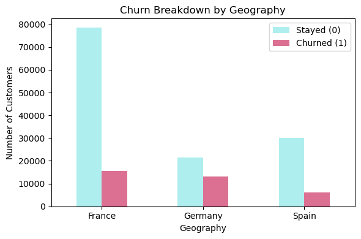
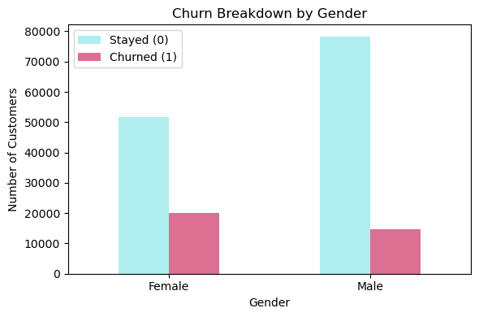
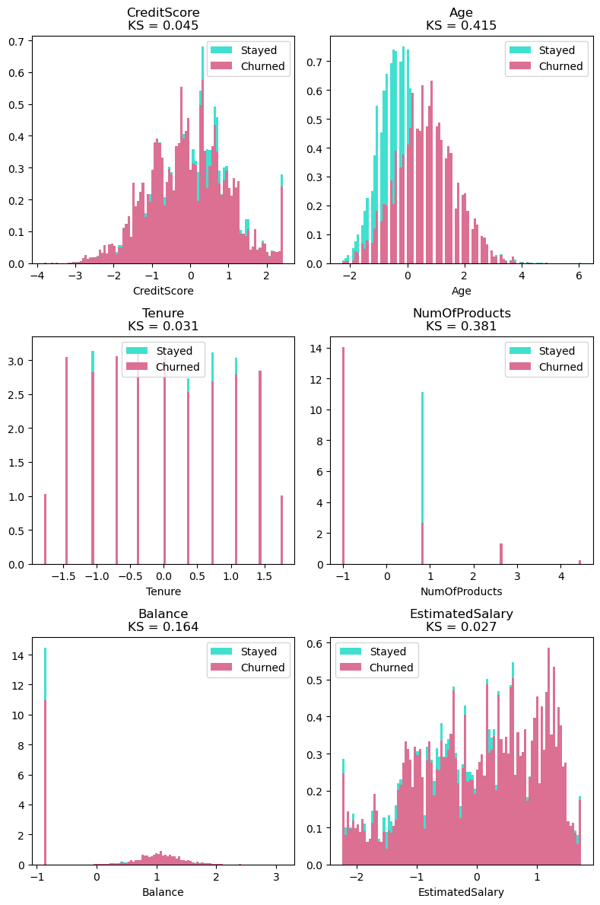

# Bank Churn Kaggle Challenge

This repository explores the use of Histogram-based Gradient Boosting to predict customer churn in a bank as part of the [Binary Classification with a Bank Churn Dataset](https://www.kaggle.com/competitions/playground-series-s4e1/overview) Kaggle challenge. 

## Overview

The goal of the Kaggle challenge was to use a tabular dataset containing various banking information to predict whether a customer retains their account or chooses to close it (churn). This repository considers the task at hand a binary classification problem and evaluates the performance of several machine learning models. Then, the model with the best performance is further fine tuned before being applied to the final dataset. In this case, Histogram-based Gradient Boosting was the best performing model, achieving an average area under the ROC curve score of 89% (0.8875). The last-updated score on the Kaggle challenge's leader board was 91% (0.9059).

## Summary of Work Done

### Data

**Type**: Tabular data (CSV format)  
- **Input**: Banking features such as tenure, credit score, balance, etc.  
- **Output**: Binary target column ("Exited"), where 0 = stayed, 1 = churned  

**Size**:  
- **Train**: 165,034 rows × 14 columns (including the "Exited" target)  
- **Test**: 110,023 rows × 13 columns (without the target)  

**Split** (done via scikit-learn's `train_test_split`:  
- 60% training  
- 20% validation  
- 20% testing

### Preprocessing / Clean up

**Null values**: None found  
**Duplicates**: Identified after removing `ID` and `CustomerID` columns. Rows with identical surnames, balances, and estimated salaries were assumed to be duplicates and removed.  

**Categorical columns**:  
- `Geography` and `Gender` encoded via `OneHotEncoder` from scikit-learn.  

**Numerical columns**:  
- `CreditScore`, `Balance`, `Age`, `Tenure`, `EstimatedSalary`, and `NumOfProducts` scaled using `StandardScaler`.  
  - (Note: Both `MinMaxScaler` and `StandardScaler` were tested and yielded comparable results.)  
- Remaining numerical columns (e.g., `HasCrCard`, `IsActiveMember`) were already in binary format and left unchanged.

### Data Visualization
A bar chart was created to visualize the distribution of the target variable. Here, an imbalance was observed with significantly more customers staying than churning.

  
  
  

Additional charts were created to explore how this class imbalance manifests across categorical features — namely **Geography** and **Gender**.

  
  
  
  
  

  
After applying standard scaling, histograms of numerical features were plotted to compare their distributions across classes. Among these, **Age** emerged as a particularly strong separator between customers who stayed and those who churned, while most of the remaining features showed less distinct class separation.

  
  

### Problem Formulation
   
The dataset contains customer features such as `Balance`, `CreditScore`, `Tenure` and so on. The goal is to predict churn rates for each customer, where 0 indicates the customer stayed and 1 indicates they churned. 
For the training dataset, the models were evaluated using the `Exited` column which gives the actual churn rates for each customers. In contrast, the test dataset does not include this column - the models must infer churn probabilities as part of the challenge submission.

  * **Models**
    * **Decision Tree**: chosen for its simplicity and history of giving good scores.
    * **Histogram-based Gradient Boosting**: selected for its robustness in providing fast and accurate results on large tabular datasets.  
    * **Random Forest**: used to leverage the power of multiple decision trees to attain potentially better scores. 
    * **Logistic Regression**: chosen because it's a simple yet effective baseline model for binary classification.
    * **K-Nearest Neighbors**: selected for a different approach to predicting based on local similarity rather than model learning.
  * **Parameters**:
    * All models were initially configured with reasonable defaults (e.g., setting `random state` and `class weight='balanced'` where applicable).
    * Histogram-based Gradient Boosting was further fine-tuned using Scikit learn's `RandomizedSearchCV` to find the optimal parameters for the model.
    * Full parameters settings and tuning details can be found in `ML.ipynb` notebook.

### Training

All of the machine learning algorithms mentioned above were implemented and trained in `ML.ipynb` notebook using the training dataset. Training times were minimal — under 1 minute for all models — due to the relatively small dataset size and the absence of deep learning computations.

### Performance Comparison

  The models were evaluated using standard classification metrics such as Accuracy, F1 Score, Precision, Recall, and most importantly, AUC Score (area under the ROC curve), which is the main evaluation metric for the Kaggle challenge.

  

| Classifier           | Accuracy |    F1    | Precision |  Recall  | AUC Score |
|----------------------|----------|----------|-----------|----------|-----------|
| LogReg               | 0.7528 | 0.7714 | 0.4458    | 0.7342 | 0.8182  |
| RandomForest         | 0.8170 | 0.8276 | 0.5448  | 0.7763 | 0.8837  |
| HGB                  | 0.8135 | 0.8249 | 0.5379  | 0.7869 | 0.8870  |
| Decision Tree        | 0.8138 | 0.8242 | 0.5399  | 0.7584 | 0.8712  |
| K-Nearest Neighbors  | 0.8441 | 0.8359 | 0.6686  | 0.5090 | 0.8192  |

  
  ROC curves and its AUC scores were calculated for all models implemented into the training dataset at 60% split. Cross-validation tests were run to ensure that the scores were not biased or happened by chance.

  
  
  
  

 
  The Histogram-based Gradient Boosting model consistently outperformed others. It was selected for further tuning and was evaluated again using an 80-20 train-test split. Interestingly, increasing the training data slightly reduced its performance but the model still maintained the highest average AUC score among all tested models.

  

    
  

  

### Conclusions

Among the top-performing models, Histogram-based Gradient Boosting had a slight edge over Decision Tree and Random Forest in this dataset. However, all three performed in similar ranges for this problem. Therefore, for this dataset, using simple models like Decision Tree can still offer strong baseline performance without withholding too much potential.

### Future Work

Future improvements could include testing other boosting algorithms such as XGBoost, LightGBM, and CatBoost — all of which are known for their high performance in structured data challenges. These models have shown strong results in similar Kaggle competitions and could potentially push AUC scores even higher. For this particular challenge, one of the models that the top scorers used was LightGBM.  

## How to reproduce results

Reproducing the results in this repository is straightforward by following the workflow described below. The recommended setup is a Jupyter Notebook environment running on macOS, with Python, Scikit-learn, and optionally the Kaggle API installed via Terminal. Additional details, including training and evaluation steps, are provided in the included notebooks.

### Overview of files in repository

Within the `Kaggle_Bank` folder, the following notebooks guide the workflow in correct order:
  * `Data_Load_N_Initial_Look.ipynb`: Downloads the bank churn dataset and explores its contents quickly.
  * `Data_Visualization.ipynb`: Creates various visualizations of the data, but all visualizations done are not limited to just this notebook.
  * `Data_Clean_N_Prep.ipynb`: Conducts preprocessing processes like deleting duplicates, one-hot encoding variables as well as scaling numerical features.
  * `ML.ipynb`: Contains functions that build various machine learning models and evaluate their performances.
  * `Bank_Churn_Final.ipynb`: Contains all the preprocessing and machine learning processes necessary to obtain results and convert them into the proper submission format.
  * `playground-series-s4e1.zip`: zipped file containing all csv files provided by the challenge.
  * `submission.csv`: Submission file created after all of the work is done. 
  * `sample_submission.csv`: A sample of the submission format provided by the challenge.
  * `train.csv`: Train dataset provided by the challenge.
  * `test.csv`: Test dataset provided by the challenge.

The `Pictures` folder contains all images displayed throughout this README file. 

### Software Setup
Ensure the following libraries are installed:
* `pandas`, `numpy`, `matplotlib`, `math`, `scipy`
* `scikit-learn`: install via `pip install scikit-learn`

### Data

Data for this challenge can be downloaded directly through the [Kaggle Challenge website](https://www.kaggle.com/competitions/playground-series-s4e1/overview). Or it can be done through the Kaggle CLI. Simply download the API for Kaggle via running `pip install kaggle` into Terminal. Then, make sure to move the `kaggle.json` API token to the correct location (`/.kaggle/kaggle.json`). Then, use the command `kaggle competitions download -c playground-series-s4e1` to download this dataset. 

### Training

The training dataset (`train.csv`) is split into Train (60%), Validation (20%), and Test (20%) sets. Various models are then trained using the training portion and evaluated on the validation and test sets.

### Performance Evaluation

Model performance is assessed using the **AUC** score, alongside other metrics like accuracy, precision, recall, and F1 score. Cross-validation is also applied to verify consistency.

## Citations

 Kaggle Dataset: Walter Reade and Ashley Chow. Binary Classification with a Bank Churn Dataset . ([https://kaggle.com/competitions/playground-series-s4e1](https://kaggle.com/competitions/playground-series-s4e1)), 2024. Kaggle.

